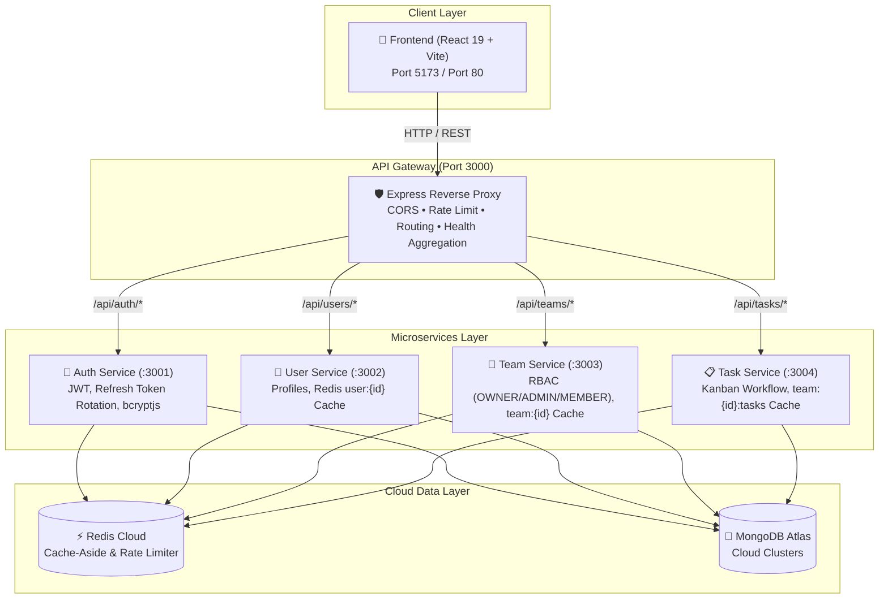

# 🚀 TaskFlow — Microservices Task & Team Management System

[](https://www.typescriptlang.org/)
[](https://nodejs.org/)
[](https://expressjs.com/)
[](https://www.mongodb.com/cloud/atlas)
[](https://redis.io/)
[](https://react.dev/)
[](https://www.docker.com/)

A production-grade, enterprise-ready microservices system for managing teams, users, and tasks featuring JWT authentication with refresh token rotation, role-based access control (RBAC), Redis cache-aside caching, fixed-window rate limiting, and MongoDB persistence — exposed via an API Gateway and a modern React SPA.

---

## 🏛️ Architecture Overview



---

## 🛠️ Microservices Breakdown

| Service | Port | Responsibilities | Key Patterns & Technologies |
|---|---|---|---|
| **API Gateway** | `3000` | Single entry point, reverse proxy, CORS security, centralized health status | `http-proxy-middleware`, `helmet`, `cors` |
| **Auth Service** | `3001` | User registration, login, token refresh rotation, auth token revocation | `jsonwebtoken`, `bcryptjs`, Redis Token Storage |
| **User Service** | `3002` | User profile retrieval & modification | Redis Cache-Aside (`user:{id}`, TTL 10m) |
| **Team Service** | `3003` | Team lifecycle, member invitations, granular RBAC permissions | Redis Cache (`team:{id}`), Role Guarding |
| **Task Service** | `3004` | Task board management (TODO, IN_PROGRESS, DONE) | Redis Cache (`team:{id}:tasks`), Permission Validation |
| **Frontend** | `5173` / `80` | Modern responsive UI, Kanban board, Auth state management | React 19, Vite, Pure CSS (Dark Mode) |

---

## 🔒 Security & Core Backend Principles Demonstrated

1. **JWT Authentication & Token Rotation:**
   - Short-lived Access Tokens (15 min) for stateless request authorization.
   - Long-lived Refresh Tokens (7 days) stored in Redis with reuse detection.
2. **Role-Based Access Control (RBAC):**
   - Team level permissions: `OWNER` (full admin + deletion), `ADMIN` (manage members/tasks), `MEMBER` (collaborator).
   - Platform level roles: `USER` and `ADMIN`.
3. **Redis Cache-Aside Pattern:**
   - Reads: Check Redis cache -> On miss, query MongoDB and store in Redis with TTL.
   - Writes: Update database and invalidate corresponding Redis keys/patterns.
4. **Redis Fixed-Window Rate Limiting:**
   - Protects endpoints from abuse using atomic `INCR` + `EXPIRE` counters (60 req/min per user/IP).
   - Returns standard `X-RateLimit-*` headers and `429 Too Many Requests`.
5. **Layered Clean Architecture:**
   - `Routes` -> `Middleware (Auth/Validation/RateLimit)` -> `Controllers` -> `Services` -> `Repositories` -> `Models`.
6. **Robust Input Validation:**
   - Strict Zod schemas on all request parameters, query strings, and request bodies.
7. **Production Hardening:**
   - `Helmet` security headers, strict CORS configuration, structured JSON logging with `Pino`.

---

## ⚙️ Cloud Configuration Guide

### 1. MongoDB Atlas Setup
1. Create a free cluster on [MongoDB Atlas](https://www.mongodb.com/cloud/atlas).
2. Under **Database Access**, create a user (e.g. `taskflow_user`) and password.
3. Under **Network Access**, add `0.0.0.0/0` (allow access from anywhere) or your IP.
4. Click **Connect** -> **Drivers** -> Copy the connection URI:
   ```env
   MONGODB_URI=mongodb+srv://taskflow_user:<password>@cluster0.abcde.mongodb.net/taskflow?retryWrites=true&w=majority
   ```

### 2. Redis Cloud Setup
1. Create a free 30MB database on [Redis Cloud](https://redis.io/try-free/).
2. Copy the **Public Endpoint** and **Password** from your Redis database configuration:
   ```env
   REDIS_HOST=redis-12345.c10.us-east-1-2.ec2.cloud.redislabs.com
   REDIS_PORT=12345
   REDIS_PASSWORD=your_redis_password
   ```

---

## 🚀 Quick Start (Local Development)

### 1. Clone & Install
```bash
git clone https://github.com/Raviksharma2005/Microservices-based-Task-tracker-system-.git
cd Microservices-based-Task-tracker-system-
npm install
```

### 2. Configure Environment
```bash
cp .env.example .env
# Edit .env with your MongoDB Atlas and Redis Cloud credentials
```

### 3. Build & Run
```bash
# Build shared library
npm --workspace=shared run build

# Run all backend microservices concurrently
npm run dev:services

# In a new terminal, launch frontend
npm run dev:frontend
```

Open [http://localhost:5173](http://localhost:5173) in your browser.

---

## 🐳 Docker Deployment

To launch the full system locally or in cloud container hosting:

```bash
docker-compose up --build -d
```

---

## 🧪 Testing

Run the automated test suite across all services:

```bash
npm test
```

---

## 📑 API Reference & Postman Collection

Import [`docs/TaskFlow.postman_collection.json`](docs/TaskFlow.postman_collection.json) directly into Postman.

### Auth Endpoints
- `POST /api/auth/register` — Register new user
- `POST /api/auth/login` — Authenticate and receive JWTs
- `POST /api/auth/refresh` — Refresh access token
- `GET /api/auth/me` — Get current logged-in user profile
- `POST /api/auth/logout` — Revoke refresh token

### User Endpoints
- `GET /api/users/me` — Get own profile (cached)
- `GET /api/users/:id` — Get user profile by ID
- `PUT /api/users/:id` — Update profile info (invalidates cache)

### Team Endpoints
- `POST /api/teams` — Create team (caller becomes OWNER)
- `GET /api/teams/my/list` — List teams user belongs to
- `GET /api/teams/:id` — Get team details (cached)
- `PUT /api/teams/:id` — Update team details (OWNER/ADMIN)
- `DELETE /api/teams/:id` — Delete team (OWNER only)
- `POST /api/teams/:id/members` — Add team member (OWNER/ADMIN)
- `DELETE /api/teams/:id/members/:userId` — Remove team member (OWNER)

### Task Endpoints
- `POST /api/tasks` — Create task within a team
- `GET /api/teams/:id/tasks` — List tasks for a team with pagination & filters
- `GET /api/tasks/:id` — Get single task details
- `PUT /api/tasks/:id` — Update task status/title/assignee
- `DELETE /api/tasks/:id` — Delete task

---

## 👨‍💻 Resume Ready Highlights

```text
TaskFlow — Microservices Task & Team Management System
• Designed and developed a 4-service microservices architecture (Auth, User, Team, Task) with TypeScript, Node.js, Express, and React 19.
• Implemented JWT authentication with refresh token rotation and granular RBAC (OWNER/ADMIN/MEMBER) for enterprise access security.
• Integrated Redis Cloud for sub-millisecond cache-aside reads and fixed-window distributed rate limiting (60 req/min).
• Structured persistence with MongoDB Atlas with schema validation, compound indexing, and clean repository abstractions.
• Containerized the entire ecosystem with Docker multi-stage builds, orchestrated via Docker Compose, with full automated Vitest test coverage.
```
